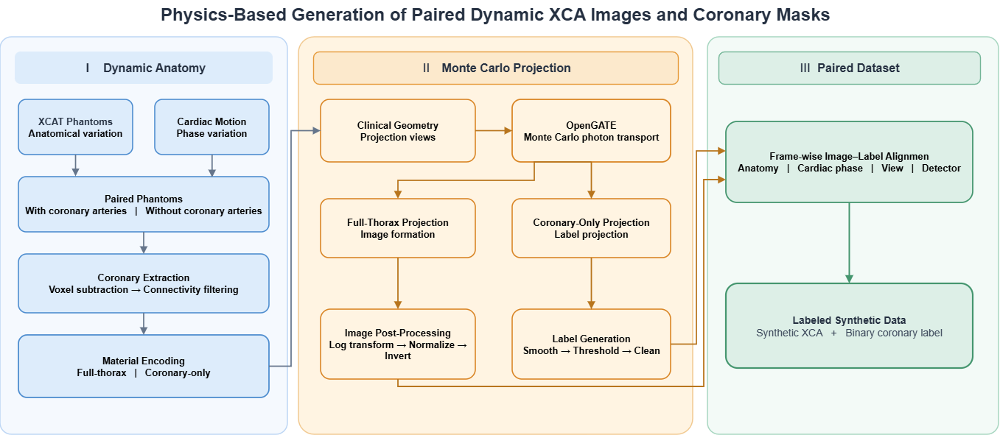
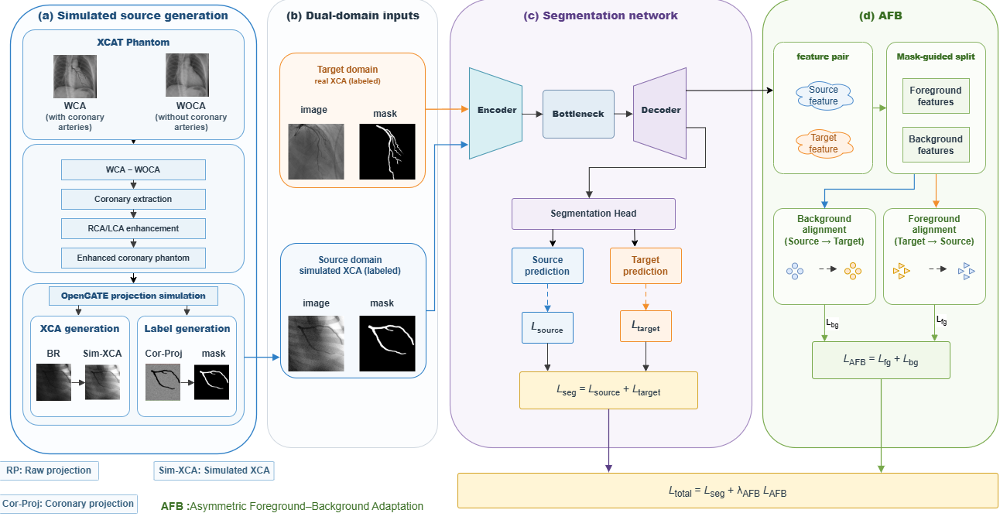

# AFB: Sim-to-Real Coronary Artery Segmentation in XCA

Pixel-level annotation of X-ray coronary angiography (XCA) requires specialists to delineate individual vessel segments along major trunks, bifurcations, and distal branches, making annotations difficult and costly to obtain. Consequently, limited annotated datasets often fail to capture the variability in coronary anatomy, clinical projection angles, and cardiac motion. Physics-based simulation provides a readily accessible means of generating training samples with three-dimensional anatomical origins and spatially registered labels. However, domain shifts persist between simulated and real-world XCA because of differences in device response, tissue superposition, scatter noise, and contrast-agent distribution. A key challenge in simulation-assisted coronary artery segmentation is therefore to exploit the structural supervision provided by simulated data while reducing discrepancies in image appearance and combining the complementary strengths of the two domains. To address this challenge, we propose Sim2Real-AFB. Using dynamic digital human models and Monte Carlo-based physical projection, the framework generates simulated XCA images and spatially corresponding labels across diverse anatomical models, clinical projection angles, and consecutive cardiac phases. It then incorporates a region-reliability-aware asymmetric foreground–background adaptation module into a shared segmentation network. The simulated-domain foreground serves as a structural reference for coronary arteries and guides the adaptation of the real-domain foreground, whereas the real-domain background serves as a reference for clinical image appearance and guides the adaptation of the simulated-domain background. Stop-gradient operations keep the corresponding reference domains fixed during adaptation. Experiments on multiple real-world XCA datasets demonstrate that Sim2Real-AFB converts coronary structural priors from simulated data into effective clinical supervision through region-selective cross-domain transfer. It consistently improves segmentation performance under varying annotation regimes and enhances the completeness of distal branches and faintly opacified vessels.

## Method Overview



The simulation diagram shows how XCAT phantoms and OpenGATE projections produce paired XCA images and coronary artery labels.



The segmentation network is implemented in `net.py`, `CASE.py`, `AA_DSMamba2.py`, and `PHFP.py`. In `AFB.py`, labels split the `O4` features into foreground and background regions. By default, foreground features are aligned from target to source, while background features are aligned from source to target. The `joint_da` objective combines source segmentation loss, target segmentation loss, and a weighted AFB loss. Both training domains require labels.

## Data and Environment

Each dataset split follows the same structure. Filenames in `ICA_PNG` and `label` must match:

```text
dataset/
├── source/train/{ICA_PNG,label}/
└── target/{labeled_train,val,test}/{ICA_PNG,label}/
```

Images and labels are resized to 512×512 when loaded. All training modes require target-domain `val` and `test` splits. Use `--source_train_path`, `--target_train_path`, `--target_val_path`, and `--target_test_path` to specify other locations.

Dependencies are listed in `requirement.txt`, which specifies PyTorch builds for CUDA 12.8:

```powershell
python -m pip install -r requirement.txt --extra-index-url https://download.pytorch.org/whl/cu128
```

## Run

```powershell
# Main experiment: supervised training on both domains with AFB alignment
python train_ssda.py --mode joint_da --run_name afb_experiment

# Baseline modes: target_only, source_only, joint_no_da, dual_no_da
python train_ssda.py --mode target_only

# Evaluate the included checkpoints (default data: dataset/target/test)
python test.py --model_path .\ARCADE\AFB.pth --output_dir .\outputs\ARCADE_AFB
python test.py --model_path .\DCA1\AFB.pth --output_dir .\outputs\DCA1_AFB
```

Training outputs are saved in `weight/` and `logs/`. Evaluation writes segmentation masks and metric CSV files. Both included checkpoints are named `AFB.pth`, so use different `--output_dir` values to avoid overwriting results. Run each script with `--help` for more options.

The included .pth checkpoints are tracked with Git LFS; install Git LFS before cloning to download the full weights.
